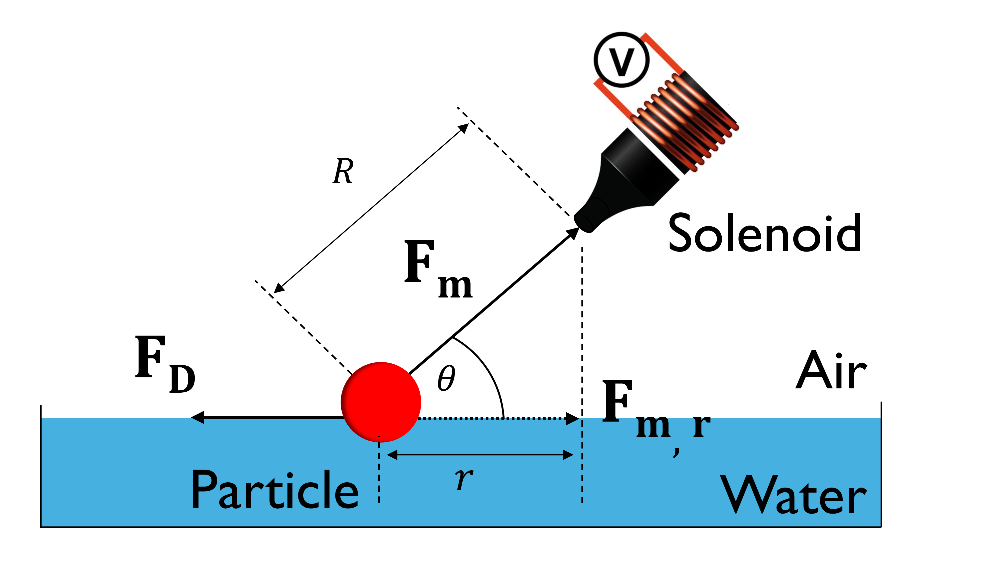
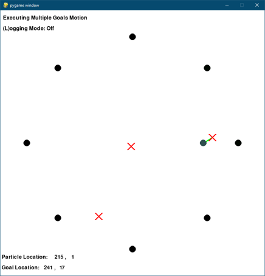

# Installation

The code can be used for training new models or testing them. Testing requires fewer dependencies and does not need a CUDA-supported GPU.

## Training

Ensure the following dependencies are installed:

- Python 3.10  
- [CUDA Toolkit 12.4](https://developer.nvidia.com/cuda-12-4-0-download-archive)  
- [requirements.txt (install with `pip install -r`)](../FM3-MicRo/requirements.txt)  
- [FlashAttention (optional, speeds up inference for long input sequences)](https://github.com/Dao-AILab/flash-attention)  

To start training, modify the `.\run-scripts\train_script_*` files or execute:
```
python src\FM3_MicRo\rl.py --exc train
```
For a list of available options and their description, use:
```
python src\FM3_MicRo\rl.py --help
```

## Testing
Testing does not require any of the `torch` libraries and `bitsandbytes` library, which can be removed from `requirements.txt`. If you do not have a CUDA-supported GPU or have not installed the CUDA Toolkit, their installation may fail. Other dependencies can remain since their install time and size are negligible.

Required dependencies:

- Python 3.10
- [requirements.txt (install with `pip install -r`)](../FM3-MicRo/requirements.txt)

To start testing, modify the `.\run-scripts\test_script.bat` file or execute:
```
python src\FM3_MicRo\rl.py --exc test
```

For available options, use:
```
python src\FM3_MicRo\rl.py --help
```

# Introduction
This repository contains Python code, `.bat` scripts, `.sh` SLURM scripts, media files and log files for the thesis **"Application of Foundation Model Based Methods in Micro-Robotics"** at the Robotic Instruments Lab, Aalto University by Muhammad Usama Sattar during year 2025.

We employ a novel RL technique where LLM acts as reward generator to control micro-robots via magnetic fields. The LLM receives the previous state, current state, and goal. This information is used to generate the reward value for each timestep. The idea is that LLMs can identify relevant workspace features that indicate good actions, eliminating the need for manual reward design.

For more details, refer to: [Reward Design with Language Models](https://arxiv.org/pdf/2303.00001).

# Magnetic Manipulation Setup and Simulator
The setup consists of 8 solenoids arranged in a circular configuration. A ferromagnetic particle is placed within the solenoid circle. Applying current to a solenoid attracts the particle toward it which enables precise particle placement.

<p style="margin-bottom: 20px;">
    <div style="display: flex; justify-content: center; gap: 18px;">
        
        
    </div>
</p>

<div align="center">
    
</div>

## System Mechanics

The particle is accelerated toward the solenoids by magnetic force. Fluid drag from the water surface reduces its momentum while the meniscus effect pulls the particle toward the petri dish center, though this is negligible due to the dish's size.

Thus, the system dynamics are governed by only magnetic and drag forces, as shown below:

<div align="center">
    
</div>

## Simulator

The simulator is built using `pygame` and mimics the experimental setup through a deep-learning-trained model. It enables simultaneous RL training on an HPC cluster.

<div align="center">
    
</div>

# Implementation
For RL, we use **PPO** from `Stable-Baselines3`. Local LLM inference is achieved through `Transformers` libary. We utilize the following **QWEN2.5-Instruct** models:

- **3B**
- **7B**
- **14B**
- **32B**

The problem has been simplified by keeping the goal position at the center for every episode. Total training timesteps are 1M. The environment provides two types of rewards:

- **Global Rewards:** Rewards that do not directly relate to local movements of the particle such as amount of time spent in an episode, staying in vicinity of the goal and achieving the goal.
- **Local Rewards:** Rewards that directly relate to local movements of the particle. In our baseline, **delta_r**, this reward is given by normalized change in radial distance r, while in **LLM Augmented RL**, this reward is provided by the LLM.

<div align="center">
    
</div>

The model has been trained using Triton HPC cluster provided by Aalto University's School of Science as part of the "Science-IT" project. We employed nodes with H100 GPUs due to their large VRAM and high clock speeds.

3 types of prompts have been utilized:
- **Zero-shot:** Description of the workspace and task requirements are provided.
- **Five-shot:** Description of the workspace and task requirements are provided along with 5 examples.
- **One-shot with Explanation:** Description of the workspace and task requirements are provided along with one example and its explanation.

Each prompt has been further differnetiated by possible output values:
- **Binary:** LLM can output either a 0 or 1.
- **Continuous:** LLM can output any integer from -9 to +9.

# Results
We only provide key results in the markdown. You can find the complete dataset of plots in [./media/](./media/).
## Reward Maps
Reward Maps illustrate the reward values for moving from a paritcular location to another. The shape of the maps reveal the variation in performance with various prompts and model sizes. Key features are:

- **Black Cross:** Goal Position
- **Black Dot:** Initial Particle Position
- **Colored Dot:** Final Particle Position

<div align="center">
    
</div>

<div align="center">
    
</div>

<div align="center">
    
</div>

We observe the following trends in the figures:

- Performance improves with increasing size of model
- One-shot with Explanation > Five-shot > Zero-shot
- Binary Rewards > Continuous Rewards

## Model Evaluations
Each model was tested 100 times during its training utilizing **delta_r** rewards to mantain consistency.

<div align="center">
    
</div>

<div align="center">
    
</div>

We observe the same behaviours in evaluations as described in Reward Maps. Notably **Binary One-shot with Explanation** performs even better than our baseline **delta_r**. This underscore the benefits of utilizing LLMs as reward generators due to their ability to extract additional features from the workspace resulting in improved convergence. Furthermore, utilizing **QWEN-32B-Instruct** allows even **Zero-shot** to converge, suggesting that at sufficient model sizes, accurate reward values can be generated without examples and/or explanations.

## Training Times
<div align="center">
    
</div>

The trend in the plot is counter-intuitive. Generally, larger models take more time for inference. Only possible explanation that we could find for the observed trend is a better capability of larger models to utilize GPU and software optimizations.

## Videos
You can find videos of the trained model running on the simulator and experimental setup along with log files in [./media/Test/](./media/Test/).